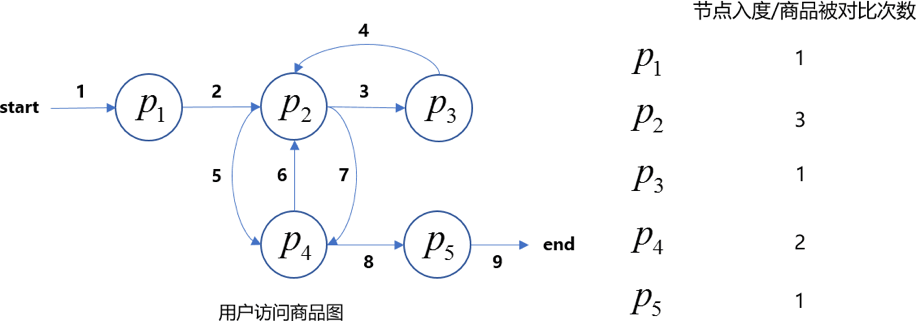
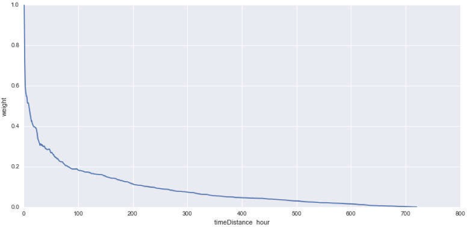

​     

## 项目说明

- 这是[JData用户下单预测比赛](https://jdata.jd.com/html/detail.html?id=1)的多模型解决方案

## 背景与方案说明

- 用户对商品的点击或者下单，体现了极强的用户兴趣倾向，对它的刻画可以用于最终推荐结果展示与搜索结果的排序。
- 在这种场景下的推荐与搜索个性化排序，解决方法是构建二分类模型，判断一个user是否会在一个item上发生点击/下单(训练集根据实际用户行为设为1或者0)，在新的场景下，使用二分类模型可以判断[user_geature, item_feature]作为输入时，输出的概率p，根据概率大小进行推荐和排序。
- 典型的建模方式是：
  - 第①种，以 [用户特征向量, 商品特征向量]的拼接为输入x，以用户是否在该商品上发生点击/下单(这里是下单)为标签y，构建二分类模型
  - 第②种，因为 用户\*商品 的对数量非常大，我们也可以单独构建用户模型，商品模型，即在上一种建模方式中，只用用户特征或者商品特征，再考虑聚合。

## 目录与文件说明

| 文件名                          | 说明                                 |
| ------------------------------- | ------------------------------------ |
| cache/                          | 缓存中间文件夹                       |
| data/                           | 存放原始数据文件夹                   |
| features/                       | 特征保存文件夹                       |
| model/                          | 模型保存文件夹                       |
| data_merge.py                   | 拼接2/3/4月数据并产生窗口字段        |
| cv_params.py                    | 交叉验证调参                         |
| skuModel_feature_extraction.py  | 商品模型特征提取                     |
| userModel_feature_extraction.py | 用户模型特征提取                     |
| gen_features.py                 | 特征生成函数文件                     |
| rules.py                        | 规则提取                             |
| sku_model.py                    | 商品模型特征文件                     |
| time_decay.py                   | 时间衰减权重文件                     |
| tools.py                        | 评测函数文件                         |
| user_model_final.py             | 用户模型特征文件                     |
| xgb_skuModel.py                 | 商品模型训练文件                     |
| xgb_userModel.py                | 用户模型训练文件                     |
| gen_result.py                   | 从训练好的模型快速产生结果文件       |
| requirements.txt                | python依赖库                         |
| pipeline.sh                     | 从原始数据提取特征并训练模型产生结果 |
|                                 |                                      |
|                                 |                                      |

## 运行说明

Python版本3.6 64位 ，Ubuntu系统

- 安装依赖包 pip install -r requirements.txt (主要是numpy,pandas,scikit-learn,已经安装可跳过)

- 安装xgboost (可以使用pip install xgboost安装，anaconda用户请使用conda install xgboost安装)，windows安装有问题的用户可以直接从 [http://www.lfd.uci.edu/~gohlke/pythonlibs/#xgboost](http://www.lfd.uci.edu/~gohlke/pythonlibs/#xgboost)下载后pip install xxx.whl安装,若已经安装可跳过。
- 如果想运行完整的数据处理、数据清洗、特征工程、建模与调参、模型融合，生成线上提交结果文件，linux和Mac同学请运行bash pipeline.sh。windows的同学建议查看pipeline内容，依次按顺序执行其中的代码流程。
  - 请提前将官方下载的JData_Action_201602.csv，JData_Action_201603.csv， JData_Action_201604.csv，JData_Comment.csv，JData_Product.csv，JData_User.csv存放至datasets文件夹下
  - 由于过程中的数据处理会产出中间结果，请把该文件夹存放至至少150G的硬盘上，并且耐心等待。

## 解题思路

### a.用户模型

#### 1.训练集，验证集，线上集划分

我们选取目标预测期间前7天与第8类商品有过交互的用户(过滤曾经购买过第8类商品的用户) 来构造样本，前60天用来提取特征。划分如下:

- 验证集

  - 特征提取区间 [2016-02-01 00:00:00, 2016-04-06 00:00:00)

  - 样本构造区间 [2016-03-30 00:00:00, 2016-04-06 00:00:00)
  - 标签提取区间 [2016-04-06 00:00:00, 2016-04-11 00:00:00)

- 训练集

  - 特征提取区间 [2016-02-06 00:00:00, 2016-04-11 00:00:00)

  - 样本构造区间 [2016-04-04 00:00:00, 2016-04-11 00:00:00)

  - 标签提取区间 [2016-04-11 00:00:00, 2016-04-16 00:00:00)

- 线上预测集

  - 特征提取区间 [2016-02-11 00:00:00, 2016-04-16 00:00:00)

  - 样本构造区间 [2016-04-09 00:00:00, 2016-04-16 00:00:00) 

#### 2.数据预处理

删除非第8类商品的记录并丢弃model_id字段(减少内存与计算开销)，通过预测期间前7天的 用户单秒点击次数与用户点击总量/用户浏览总量(爬虫直接访问某个页面，点击数目远远小   于浏览数目，正常用户点击数目远大于浏览数目)过滤可能的爬虫用户。 

#### 3.精简版特征

- 用户属性特征
	- 用户等级
	- 用户注册时间距离(注册日距离预测区间第一天距离) (单位: 天)
- 用户时间行为特征 (范围:特征提取区间)
	- 用户总登陆天数 (单位: 天)
	- 用户第一次登陆时间至预测区间第一天时间距离 (单位: 天)
	- 用户最后一次行为时间至预测区间第一天时间距离 (单位: 秒)
	- 用户最后一次与第8类商品交互至预测区间第一天时间距离 (单位: 秒)
	- 用户前(1/2/3/5/7)天的有效行为时间(交互时间) (单位: 秒)
	- 用户前(7/15)天与第8类有过交互天数/用户前(7/15)登陆天数
- 用户行为特征 (范围: 特征提取区间)
	- 用户前(7/15/60)天与第8类商品的操作数/用户前(7/15/60)总操作数
	- 用户前7天的加购物车/删除购物车/关注行为统计
	- 用户前7天行为数/用户前7天有交互天数
	- 用户前15天的点击/加购物车/删除购物车/关注/浏览行为统计(乘上时间衰减权 重)
	- 用户前7天单秒点击频率
	- 用户前7天单秒最大点击频率
	- 用户前15天浏览总量/点击总量
	- 用户前7天在窗口(0-6,6-12,12-18,19-24)的行为数 / 前7天交互天数
	- 用户前(1/2/3/5/7)天的总入度
	- 用户前(1/2/3/5/7)天对第8类商品的入度
	- 用户前(1/2/3/5/7)天对第8类商品的入度 / 用户前(1/2/3/5/7)天的总入度
	- 人工规则特征 (该规则在rule.py中有实现，具体为高潜用户ID)

#### 4.重要特征

- 1.用户等级
- 2.用户注册时间距离(注册日距离预测区间第一天距离) (单位: 天)
- 3.用户总登陆天数 (单位: 天)
- 4.用户第一次登陆时间至预测区间第一天时间距离 (单位: 天)
- 5.用户最后一次行为时间至预测区间第一天时间距离 (单位: 秒)
- 6.用户最后一次与第8类商品交互至预测区间第一天时间距离 (单位: 秒)
- 7.用户前(1/2/3/5/7)天的有效行为时间(交互时间) (单位: 秒)
- 8.用户前(7/15/60)天与第8类商品的操作数/用户前(7/15/60)总操作数
- 9.用户前15天的点击/加购物车/删除购物车/关注/浏览行为统计(乘上时间衰减权重)
- 10.用户前7天单秒点击频率
- 11.用户前(1/2/3/5/7)天对第8类商品的入度
- 12.用户前15天浏览总量/点击总量
- 13.人工规则特征 (该规则在rule.py中有实现，具体为高潜用户ID)

以上特征为用户模型关键特征，**大部分特征是通过统计分析发现**，有两个特征(10,12)用于过滤 爬虫用户,并且其本身能反映用户的活跃程度。

人工规则特征是基于统计分析发现，具体关注于短期登陆用户的行为分析(近期登陆在前7天，且用户行为只集中于第8类商品，用户等级>2,交互天数<=2,加购过第8类商品)，该规则结果本身在A榜使得f11达到0.254+的成绩，在模型中也有着高分表现。**入度特征为原创特征**，下图为入度特征的解释

**将用户与第8类商品的操作转化为图模型，展示了一位用户的图模型，其中节点表示商品，路径上的数字表示用户访问该商品的顺序，节点的入度表示了商品被对比的次数，整个图的入度表示了用户对比商品的次数，用户更易购买其来回对比多次的商品，例如图中商品２被对比了３次，其他商品的入度都比该商品低，所以商品２被购买量可能性更大。待研究：图中每个节点都包含自身的能量（用户对该节点商品的操作,如点击，浏览，添加），该能量表示用户对该商品的关注度，整个图的能量表示了用户的对第八类商品的关注度。**

时间衰减特征是通过统计各个时间窗口的未来购买用户/当前窗口用户数归一化得来，该特征在模型中也有不错的效果。

 

#### 5.模型选择与训练

- 本次只使用了单模型xgboost，该模型支持并行训练，接口丰富且精度高，作为首选模型，大家可以配合LightGBM和RandomForest等一起使用。

- 模型训练过程中样本正负比例极度不平衡，原本打算通过xgboost欠拟合训练筛选样本，但是由于计算量的原因暂时没有使用，**模型中简单设置了xgboost的scale_pos_weight参数来降低该影响。参数调优使用的是sklearn中的网格搜索。**

 

### b.商品模型

#### 1.训练集，验证集，线上集划分

- **商品模型**的训练集，验证集，线上集划分窗口与**用户模型**一致，选取的是预测区间前7天与第8类商品有过交互的**用户-商品pair**做样本
  - 前7天可预测的样本占35%且样本比例在1:400~500之间
  - 曾考虑扩大样本范围，前30天可预测样本占45%,但是正负比例在1:1100+
  - 考虑到模型的泛化与机器的配置，选择前7天较为划算)
  - 过滤掉购买过第8类商品的用户的所有交互行为。(**基于统计发现购买过第8类商品的用户短期并不会再次购买**)

#### 2.数据预处理

初期预想保留每个用户总行为TopN个样本，但是用户基数大，筛选耗时较长，时间有限， 并未实现，因此商品模型未做处理，正负比约在1：400~500。

#### 3.精简版特征

**商品特征整合了用户特征(用户属性特征与用户-品类特征)，已经在用户模型表述，之后将不再赘述。**

- 用户-商品特征
	- 用户与商品最早/晚交互时间至预测窗口时间距离 (单位 秒)
	- 用户前(7/15/28/60)天与该商品有交互的天数
	- 用户前(7/15/28/60)天与该商品有交互的天数 / 用户前(7/15/28/60)登陆天数
	- 用户前28天对该商品的总交互行为统计(乘上时间衰减权重)
	- 用户前28天对该商品的浏览/加购物车/删除购物车/关注/点击行为统计(乘上时间 衰减权重)
	- 用户前(4h,8h,16h,24h,2,3,5,7,15,28)对该商品加购物车/关注行为统计
	- 用户前(1/2/3/5/7/15/28)天的对该商品总行为数/用户前(1/2/3/5/7/15/28)总行为数
	- 用户前(1/2/3/5/7)天对该商品的有效交互时间
	- 用户前(1/2/3/5/7)天对该商品的有效交互时间 / 用户前(1/2/3/5/7)天对该类商品的有效交互时间
	- 用户对该商品前7天的浏览数/点击数
	- 用户前(4h,8h,16h,24h,2,3,5,7)对该商品的入度
	- 用户加购该商品数目/总购物车数目
- 用户-品牌特征
	- 用户前(1/3/5/7/10/14/28)对该品牌的操作数/用户前(1/3/5/7/10/14/28)的总操作数
- 商品特征
	- 商品近期差评率
	- 商品属性特征(one-hot)
	- 商品前(1/2/3/5/7/10)的净流量/该特征提取窗的总净流量(净流量:指访问用户数目)
- 其他特征
	- 该商品前(1/2/3/5/7/10/14/28)销量/该商品品牌同类商品(1/2/3/5/7/10/14/28)的销量

#### 4.重要特征

- 1.用户与商品最早/晚交互时间至预测窗口时间距离 (单位 秒)
- 2.用户前(7/15/28/60)天与该商品有交互的天数 / 用户前(7/15/28/60)登陆天数
- 3.用户前28天对该商品的总交互行为统计(乘上时间衰减权重)
- 4.用户前28天对该商品的浏览/加购物车/删除购物车/关注/点击行为统计(乘上时间衰减 权重)
- 5.用户前(1/2/3/5/7/15/28)天的对该商品总行为数/用户前(1/2/3/5/7/15/28)总行为数
- 6.用户前(1/2/3/5/7)天对该商品的有效交互时间
- 7.用户前(1/2/3/5/7)天对该商品的有效交互时间 / 用户前(1/2/3/5/7)天对该类商品的有效交互时间
- 8.用户对该商品前7天的浏览数/点击数                
- 9.用户前(4h,8h,16h,24h,2,3,5,7)对该商品的入度
- 10.用户加购该商品数目/总购物车数目
- 11.商品近期差评率
- 12.商品前(1/2/3/5/7/10)的净流量/该特征提取窗的总净流量(净流量: 指访问用户数目)
- 13.该商品前(1/2/3/5/7/10/14/28)销量/该商品品牌同类商品(1/2/3/5/7/10/14/28)的销量

**以上特征与用户模型的重要特征均为商品模型的重要特征，思考特征方向为用户特征，用户- 品类，用户-商品，用户-品牌，商品特征与其他交叉特征。整个思考流程是先确定用户是否    购买商品，然后通过用户对商品的关注程度与活动契机来预测用户是否购买。特征12反映了 商品近期的热销程度，特征13反映了商品在同类商品的热销程度，其他特征均为衡量用户对商品的关注程度。**

#### 5.模型选择与训练

- 商品模型依旧采用xgboost算法，由于样本数量较大，cv调参速度慢，只调整了部分参数。

- 由于用户模型与商品模型的正负比例极度不均衡且正例数目极少，在训练模型的时候为了保证更多的正例被学习到，这里并没有划分部分数据用于观察模型的loss来控制模型的拟合程度，而是直接使用了全部数据训练，通过5折交叉验证获取最佳迭代次数。
- 预测是结合了用户模型的预测结果，选取用户模型Top500,然后在商品模型中选择用户购买概率最大的商品，商品模型选择Top500,两者取并集为提交结果，该融合方式为排行榜总分带来了很大的提升。

### c.关键点说明

该比赛非常重要的几点是

- 大家一定要观察评估指标，并且保证你的调参是和评估指标统一的。注意到该场景下的评估指标不一定是xgboost或者LightGBM中已经实现的，因此可能需要自己实现或者离线单独做一些评估。
- 一定要预留验证集进行调参，不能盲目跟随排行榜的情况调参，这一点非常重要，否则切换数据或者A榜换B榜会有很大变化。